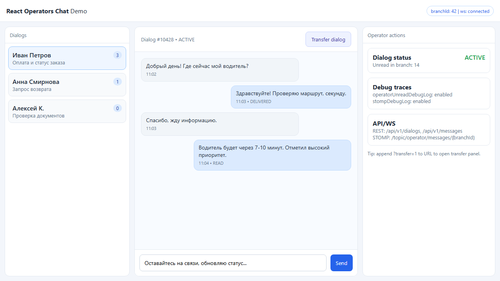
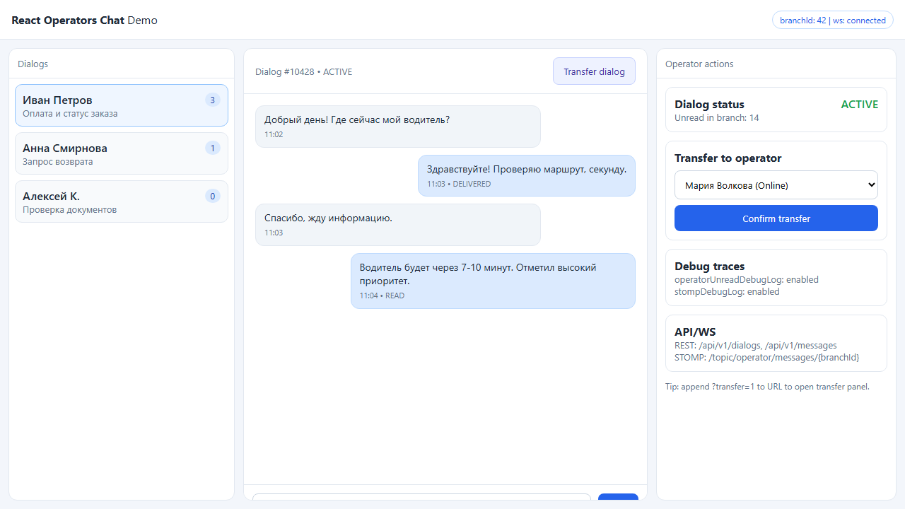

# React Operators Chat

Документация и **эталонная копия** виджета чата операторов (React + MUI + STOMP поверх WebSocket + REST). Репозиторий предназначен для сторонних разработчиков, которым нужно подключить такой же клиент к **своему** бэкенду.

**Автор / GitHub:** [Evgeniy-makdak](https://github.com/Evgeniy-makdak)

## Why this repository matters

- Shows a production-style operator chat architecture: REST + STOMP/WebSocket + optimistic UI behavior.
- Reduces integration time for backend teams by documenting exact API expectations.
- Provides a reusable reference implementation for companies building dispatch, logistics, support, and operations dashboards.

## Quick Start (for integrators)

1. Copy `reference/chat-widget/` into your host React project.
2. Wire host dependencies (`@shared/*`, app store, i18n keys `chat.*`).
3. Provide runtime config (`apiUrl`, `wsUrl`) and JWT auth.
4. Implement REST/STOMP routes listed below.
5. Validate with your branch-scoped flow (`branchId`) and unread counters.

Detailed setup guide: `docs/INTEGRATION_QUICKSTART.md`
Architecture notes: `docs/ARCHITECTURE.md`

## Live Demo & Screenshots

- Demo page (GitHub Pages): [Open demo](https://evgeniy-makdak.github.io/react-operators-chat/demo/)
- Local static demo source: `docs/demo/index.html`
- If demo link is unavailable: in repo settings enable GitHub Pages with source `gh-pages` branch (`/root`).

## For Hiring Managers

This repository demonstrates practical frontend engineering in a real-time domain:

- Real-time architecture design (STOMP topics, reconnect logic, delivery/read confirmations).
- Product-oriented UX decisions (dialog transfer, pagination, unread state sync, attachment flows).
- Integration mindset (clear backend contract, portability from monolith to standalone reference).
- Maintenance discipline (changelog, contributor docs, issue/PR templates, roadmap).

Maintainer portfolio snapshot: `PORTFOLIO.md`
Technical case study: `docs/CASE_STUDY.md`

### Interview talking points

- I extracted a real-time operator chat from a monolith into a standalone reference repository.
- I documented REST and STOMP contracts to reduce backend/frontend integration risk.
- I designed around operational reliability: reconnect behavior, delivery/read confirmations, unread consistency.
- I improved maintainability with contributor/security standards, roadmap, and collaboration templates.
- I treated the repository as a product artifact: onboarding docs, architecture diagrams, and business-oriented context.
- I can explain trade-offs (speed vs abstraction, compatibility vs strictness) and how they impact delivery timelines.

---

## Русский

### Что внутри репозитория

| Путь | Назначение |
|------|------------|
| `reference/chat-widget/` | Снимок исходников UI-виджета (как в монолите). Импорты вида `@shared/*` — ожидают хост-приложение. |
| `README.md` (этот файл) | Контракт бэкенда и веб-клиента: REST, WebSocket, STOMP; отдельно — **роль мобильного приложения** в общей схеме. |
| `LICENSE` | MIT |

Публикация на npm «из коробки» с одним `import` запланирована отдельно; сейчас основная ценность — **контракт API** и **готовый эталон разметки/логики** в `reference/chat-widget/`.

### Что обновлено в эталоне (последняя синхронизация)

- Добавлен UI передачи диалога оператору: `components/TransferOperatorSelect.tsx`.
- Добавлено debug-логирование непрочитанного: `lib/operatorUnreadDebugLog.ts`.
- Обновлены ключевые части виджета (`ChatPanel`, `MessageFeed`, `ChatContext`, `SocketContext`, `useChatDialogHandlers` и связанные стили) в соответствии с текущей версией из монолита.

### Требования к бэкенду (краткий чеклист)

1. **JWT (или совместимый токен)** в заголовке `Authorization: Bearer <token>` для HTTP и в query при открытии WebSocket: `wss://.../ws/websocket?token=<url-encoded-token>` (как ожидает эталонный клиент).
2. **Конфигурация фронта** должна отдавать как минимум:
   - `apiUrl` — база HTTP API (см. раздел REST; клиент нормализует хвостовые `/` и суффикс `/api`).
   - `wsUrl` — полный URL WebSocket до STOMP endpoint (например `wss://host/ws/websocket`).
3. **STOMP 1.1/1.0** по WebSocket: кадры `CONNECT` → `CONNECTED`, затем `SUBSCRIBE` на перечисленные destination, `SEND` на `/app/...` для подтверждений доставки.
4. **Скоуп по филиалу (branch):** и REST для списка диалогов, и часть топиков STOMP завязаны на `branchId` (число как строка в destination).
5. **CORS и cookies** — если используете `credentials: 'include'`, бэкенд должен отдавать корректные `Access-Control-*` для вашего origin.

### Мобильное приложение (не только бэкенд и веб)

Этот репозиторий описывает и отдаёт **веб-виджет для операторов**. В продуктовой схеме «оператор ↔ водитель/клиент» вторую сторону чаще закрывает **нативное или кроссплатформенное мобильное приложение**. Его реализация **в этот пакет не входит**, но без неё (или без другого клиента на той же модели данных) цепочка диалога обычно неполная.

**Что нужно со стороны мобильного приложения (и согласованного с ним бэкенда):**

1. **Те же доменные сущности** — диалоги и сообщения с теми же полями и жизненным циклом (создание, назначение, завершение, передача), что ожидает веб-виджет, либо явный слой на бэкенде, который приводит модели к одному контракту.
2. **REST (или GraphQL / BFF)** для мобильного клиента: отправка и получение сообщений, список диалогов пользователя, вложения, подтверждения **DELIVERED / READ** в том же смысле, что и `chat/delivery/confirm` / STOMP `/app/chat.delivery.confirm` — иначе счётчики непрочитанного и статусы на операторском Web разъедутся с мобилкой.
3. **Real-time на мобильном** — отдельное решение: свой WebSocket+STOMP-клиент, Firebase, собственный push→poll и т.д. Пути подписок у мобильного клиента **могут отличаться** от `/topic/operator/messages/{branchId}` (они заточены под оператора); бэкенд должен маршрутизировать сообщения и для очередей **пользователя** (`/user/queue/messages` и аналоги для роли «клиент»), либо эквивалент через push + sync.
4. **Push-уведомления (FCM / APNs и т.д.)** — когда приложение в фоне, операторские сообщения обычно приходят через push; бэкенд связывает device token, состав payload и открытие нужного диалога по deep link. Это **не** реализовано в веб-виджете и должно быть спроектировано отдельно.
5. **Авторизация** — токены, обновление сессии, хранение на устройстве; согласование с тем же identity provider, что и у SPA операторов.
6. **Вложения** — загрузка фото/файлов с телефона в те же или совместимые эндпоинты, лимиты размера и проверка типов на сервере.

Итого: README про **HTTP/STOMP-контракт** в основном отражает **операторский веб-клиент**. Полноценный продукт почти всегда требует **отдельной спецификации и реализации мобильного клиента** плюс доработок бэкенда под push, мобильные токены и, при необходимости, отдельные subscription destination для роли «пользователь приложения».

### REST API (ожидаемые маршруты)

Все пути ниже — **относительно** нормализованной базы API (в эталоне к `apiUrl` добавляется строка пути без ведущего `/`, кроме отдельно отмеченных случаев). Формат ответов: как в типичном Spring-бэке (`content`, `totalElements`, `pageable` для страниц).

#### Диалоги (`DialogsApi`)

| Метод | Путь | Назначение |
|--------|------|------------|
| POST | `api/v1/dialogs/{userId}/assign` | Назначить диалог пользователю `userId`. |
| POST | `api/v1/dialogs/{dialogId}/complete` | Завершить диалог. |
| POST | `api/v1/dialogs/transfer` | Тело: `{ dialogId, targetOperatorId }` — передать диалог. |
| DELETE | `api/v1/dialogs/{dialogId}` | Удалить диалог. |
| GET | `api/v1/dialogs` | Список диалогов. |
| POST | `api/v1/dialogs` | Создать диалог (тело — объект с полями по договорённости с бэком). |
| GET | `api/v1/dialogs/{dialogId}` | Диалог по id. |
| GET | `api/v1/dialogs/count` | Счётчик (ожидается объект с полем `count`). |
| GET | `api/v1/dialogs?all.countMessages.equals=true&all.status.in=ACTIVE,CLOSED` | Список «с сообщениями» без фильтра филиала (fallback). |
| GET | `api/v1/dialogs?all.countMessages.equals=true&all.branch.id.in={branchId}&all.status.in=ACTIVE,CLOSED` | То же с фильтром по филиалу. |

#### Сообщения (Spring Data REST-стиль)

| Метод | Путь | Назначение |
|--------|------|------------|
| GET | `api/v1/messages?all.dialog.id.equals={dialogId}&page=&size=&sort=` | Страница сообщений диалога (часто `sort=createdAt,desc`). |
| GET | `api/v1/messages?all.dialog.owner.id.equals={userId}&page=&size=` | Сообщения по владельцу/пользователю. |

Виджет также запрашивает **оценку позиции** сообщения для подгрузки страниц:

| GET | `api/v1/messages/count?all.dialog.id.equals={dialogId}&all.createdAt.greaterThan={encoded}&sort=createdAt,desc` |

#### Дополнительные HTTP-эндпоинты чата (обёртка `fetch` в эталоне)

| Метод | Путь | Назначение |
|--------|------|------------|
| POST | `chat/delivery/confirm` — тело `{ uuidMessage, status }`, `status`: `DELIVERED` \| `READ` | Подтверждение доставки/прочтения. |
| POST | `chat/request/confirm` | Тело: JSON-массив UUID сообщений — запрос статусов. |
| POST | `chat/read` | Отметка прочитанного (тело по договорённости). |
| GET | `chat/dialogs` / `chat/dialogs?user_id=` | Legacy-список диалогов (если используется). |
| GET | `chat/messages/{dialogId}` | Legacy сообщения (если используется). |
| POST | `chat/upload` | `multipart/form-data` с полем `file`. |

#### Фото для вложений в чат

| POST | `api/v1/chats/photos/{userId}` | `multipart/form-data`: поля в эталоне — `hash` (Base64url MD5), `image` (файл). Ответ: массив объектов с минимум `fileName` для id вложения. |

#### Пользователи для выбора собеседника в чате

Эталон дергает список пользователей с путём вида:

`GET api/users/full-name?page=&size=&...&all.groupMembership.group.id.in=200,300&all.isActive.in=true&sort=surname,firstName,middleName`

Плюс фильтры по филиалу/датам/строке поиска (см. в хост-приложении функцию построения URL для «чата»). **Важно:** группы `200,300` в эталонном проекте — это допуск к ролям «водитель / сервис»; на своём бэкенде замените на свои id или договоритесь о другом фильтре.

Для загрузки участников вложений используется отдельное построение URL (`getListToAttachments` в монолите) — при переносе сверьтесь с `getUrlForQueries.ts` в исходном репозитории.

### WebSocket и STOMP

#### Подключение

- URL: значение `wsUrl` из конфига (или производное `apiUrl` с заменой `http→ws`, `https→wss` и суффиксом `ws/websocket`).
- Query: `?token=<JWT>` (url-encoded).

После `CONNECT` и `CONNECTED` клиент подписывается на destinations (для **текущего** `branchId`):

| Destination | Назначение (логика эталона) |
|-------------|-----------------------------|
| `/topic/operator/messages/{branchId}` | Сообщения/события для операторов филиала. |
| `/user/queue/messages` | Персональная очередь сообщений пользователя. |
| `/queue/unread/{branchId}` | Непрочитанные по диалогам или агрегаты (тело: массив объектов или один объект). |
| `/user/queue/unread` | Глобальный счётчик: ожидается поле `countUnMessages` (number). |
| `/topic/dialog/status/{branchId}` | Статусы диалогов. |
| `/user/queue/errors` | Ошибки (клиент показывает `type: 'error'`). |
| `/user/queue/status` | Статусы обработки. |

Форматы тел **`MESSAGE`** не жёстко зафиксированы в открытом типе — эталон парсит JSON и ветвится по `destination`. Для совместимости воспроизведите поведение из `SocketContext.tsx` в `reference/chat-widget/`.

#### Исходящие SEND (клиент → сервер)

| Destination | Тело |
|-------------|------|
| `/app/chat.delivery.confirm` | `{ "uuidMessage": "...", "status": "DELIVERED" \| "READ" }` |
| `/app/chat.request.confirm` | JSON-массив строк UUID сообщений |

### Состояние приложения на хосте (эталонные ожидания)

Виджет читает из глобального store (в монолите Zustand `appStore`):

- `authId` — id текущего пользователя;
- `selectedBranchState.id` — id филиала для REST и STOMP;
- `permissions` — строковые ключи прав; для отображения футера чата нужны права, содержащие подстроку `CHAT` (см. `ChatFooter.tsx` в эталоне).

На стороне интегратора нужно либо пробросить эти поля в свой store, либо адаптировать импорты.

### i18n

Компоненты используют `react-i18next` и ключи вроде `chat.*`. В эталоне также есть прямой вызов `i18n.t('chat.needTakeToSendDefault')` в обработчиках. Нужны соответствующие строки или замена на свои.

### Безопасность и продакшен

- Токен в query WebSocket виден в DevTools — это осознанный компромисс эталона; на бэке допустимо принять токен из Sec-WebSocket-Protocol или cookie, если клиент доработан.
- Ограничьте размер вложений и проверяйте MIME на сервере (клиент в эталоне режет/валидирует изображения перед загрузкой).

---

## English

### Repository layout

| Path | Purpose |
|------|---------|
| `reference/chat-widget/` | Snapshot of the operator-chat React module. Imports still target a host app (`@shared/*`, app config, i18n). |
| `README.md` | **Backend + web contract**; also **mobile app** expectations in a typical operator ↔ user setup. |
| `LICENSE` | MIT |

This package is documentation-first plus a **reference implementation**. Publishing a one-line `npm install` build may follow; for now, treat `reference/chat-widget/` as source to diff or port.

### Latest reference sync (highlights)

- Added transfer UI for reassigning dialogs: `components/TransferOperatorSelect.tsx`.
- Added unread-state debug helper: `lib/operatorUnreadDebugLog.ts`.
- Updated core widget internals (`ChatPanel`, `MessageFeed`, `ChatContext`, `SocketContext`, `useChatDialogHandlers` and related styles) to match the current monolith version.

### Backend checklist

1. **Bearer JWT** on HTTP (`Authorization: Bearer …`) and the **same token** passed as `?token=` on the WebSocket URL (URL-encoded), matching the reference client.
2. Expose **runtime config** to the SPA: at least `apiUrl` and `wsUrl` (full `wss://…/ws/websocket` style endpoint).
3. **STOMP over WebSocket** (`CONNECT` / `CONNECTED`, then `SUBSCRIBE` / `MESSAGE` / `SEND`).
4. **Branch-scoped** dialog lists and several STOMP destinations use `branchId`.
5. **CORS** compatible with `fetch` + optional `credentials: 'include'` if you mirror the reference.

### Mobile app (not just backend + web)

This repo documents and ships the **operator web** widget. In a typical “operator ↔ driver/customer” product, the other side is usually a **native or cross-platform mobile app**. That client is **out of scope** for this package, but without it (or another client on the same data model) the conversation flow is often incomplete.

**What the mobile side (and backend aligned with it) must cover:**

1. **Same domain model** — dialogs and messages with compatible fields and lifecycle (create, assign, complete, transfer) as the web widget expects, or a backend façade that maps to one contract.
2. **REST (or GraphQL / BFF) for mobile** — send/receive messages, user’s dialog list, attachments, **DELIVERED / READ** acknowledgements consistent with `chat/delivery/confirm` and STOMP `/app/chat.delivery.confirm`, so unread counts and delivery states stay in sync with the operator UI.
3. **Real-time on device** — dedicated approach: mobile STOMP/WebSocket, FCM data messages, push + sync, etc. Mobile routes may **differ** from `/topic/operator/messages/{branchId}` (operator-oriented); the backend must deliver traffic to **user** queues (e.g. `/user/queue/messages`) or an equivalent for the mobile role.
4. **Push (FCM / APNs, …)** — when the app is backgrounded, operator messages usually arrive via push; the backend stores device tokens, payload shape, and deep links into the right dialog. **Not** implemented in this web widget — design separately.
5. **Auth** — token lifecycle and secure storage; same IdP as the operator SPA where applicable.
6. **Attachments** — upload from device to the same (or documented) endpoints; size/MIME enforced server-side.

**Summary:** the HTTP/STOMP contract here mainly mirrors the **operator web** client. A full product almost always needs a **separate mobile spec and implementation**, plus backend work for push, device tokens, and optional user-role STOMP destinations.

### REST (summary)

The widget expects:

- **Dialogs** under `api/v1/dialogs/...` (assign, complete, transfer, CRUD, count, filtered list with branch — see Russian table above).
- **Messages** under `api/v1/messages?all.dialog.id.equals=…` with pagination & sort.
- **Message index** helper: `api/v1/messages/count?…` for infinite scroll / page jumps.
- Optional **legacy** paths: `chat/dialogs`, `chat/messages/:id`, `chat/read`, `chat/upload`, `chat/delivery/confirm`, `chat/request/confirm`.
- **Chat photos**: `POST api/v1/chats/photos/{userId}` (multipart `hash` + `image`).
- **User picker**: `GET api/users/full-name?…` including group filter `all.groupMembership.group.id.in=200,300` in the reference app — **replace** with your role/group IDs.

Exact query-string builders live in the monolith (`getUrlForQueries`, `dialogsApi`); copy behaviour when re-implementing.

### WebSocket / STOMP

After connecting with `?token=`, subscribe to:

- `/topic/operator/messages/{branchId}`
- `/user/queue/messages`
- `/queue/unread/{branchId}`
- `/user/queue/unread` (aggregate; `countUnMessages`)
- `/topic/dialog/status/{branchId}`
- `/user/queue/errors`
- `/user/queue/status`

Client **SEND** destinations:

- `/app/chat.delivery.confirm` — `{ uuidMessage, status: "DELIVERED" | "READ" }`
- `/app/chat.request.confirm` — JSON array of message UUID strings

Payload shapes for incoming `MESSAGE` frames should match what `SocketContext.tsx` parses (see reference).

### Host application state

The reference uses a Zustand-like `appStore` with `authId`, `selectedBranchState.id`, and `permissions` (footer gated on permission strings containing `CHAT`). Replace with your DI / context when porting.

### i18n

Requires `react-i18next` keys under `chat.*` plus direct `i18n.t` calls in `ChatContext` error handling.

---

## Связь с исходным монолитом

Этот каталог может храниться **внутри** большого репозитория в папке `react-operators-chat-plugin/` или выгружен отдельным репозиторием на [GitHub](https://github.com/Evgeniy-makdak): скопируйте содержимое `react-operators-chat-plugin/` в новый repo `react-operators-chat`.

**Важно:** добавление этой папки в монолит **не меняет** само приложение: нет импортов из него в прод-сборку, пока вы сами не подключите пакет.

## Версионирование

Начните с `0.1.0` в `package.json`. При изменении контракта API увеличивайте minor/major и дополняйте этот README.

## Contributing and project standards

- Contribution guide: see `CONTRIBUTING.md`
- Security policy: see `SECURITY.md`
- Changelog: see `CHANGELOG.md`
- Planned improvements: see `ROADMAP.md`
- Architecture: see `docs/ARCHITECTURE.md`
- Integration quickstart: see `docs/INTEGRATION_QUICKSTART.md`
- Maintainer profile page: see `PORTFOLIO.md`
- Community behavior: see `CODE_OF_CONDUCT.md`
- Technical case study: see `docs/CASE_STUDY.md`
