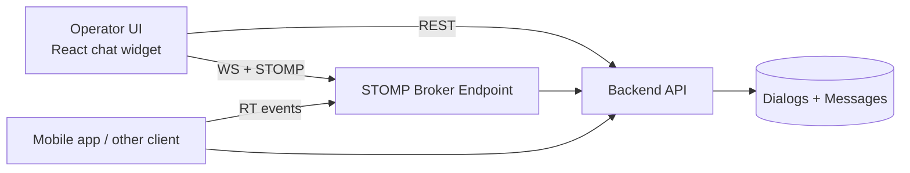
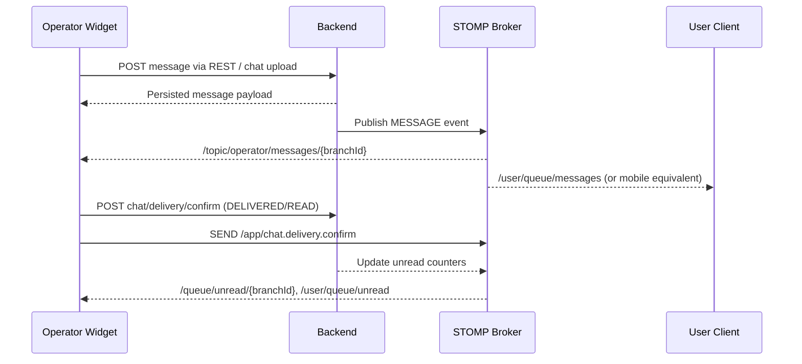

# Architecture Overview

This document describes the reference operator chat architecture and the expected backend contract.

## System context

- Frontend: React widget (`reference/chat-widget`)
- Transport: REST + STOMP over WebSocket
- Auth: Bearer JWT on HTTP and `?token=` on WebSocket connection
- Scope: Branch-aware routing (`branchId`) for dialogs and unread counters

## High-level flow

## Event lifecycle (message send and confirmations)

## Reference module boundaries

- `api.ts`, `api/dialogsApi.ts`: HTTP contract + query composition
- `contexts/SocketContext.tsx`: STOMP connect/reconnect, subscriptions, dispatch
- `contexts/ChatContext.tsx`: state orchestration, commands, side effects
- `components/*`: UI concerns (feed, input, transfer, selectors)
- `chatFooter/*`: permissions-aware controls and operator actions

## Key integration constraints

1. Keep payload semantics aligned with `SocketContext.tsx` parsing behavior.
2. Preserve branch scoping in REST filters and STOMP destinations.
3. Ensure delivery/read confirmations stay consistent across web and mobile clients.
4. Enforce attachment limits and content validation on backend side.

## Reliability notes

- Reconnect and idempotency matter more than visual latency in real-time operator tools.
- Unread counters should be treated as eventual-consistency signals, not single source of truth.
- Keep legacy endpoints available during migration if old clients still consume them.
